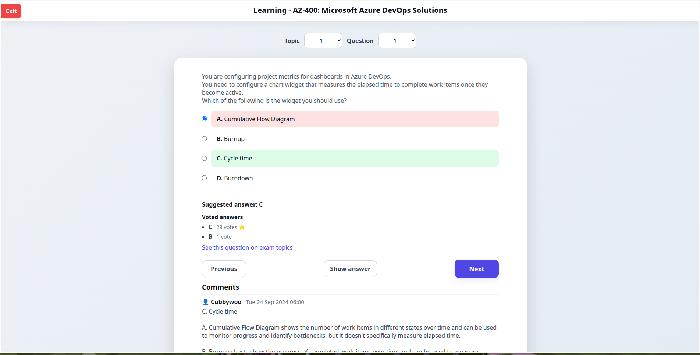
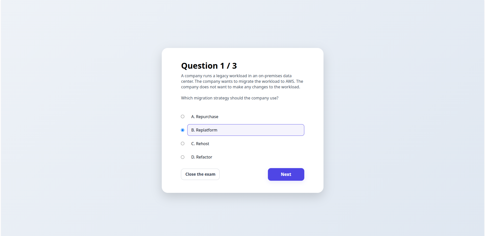
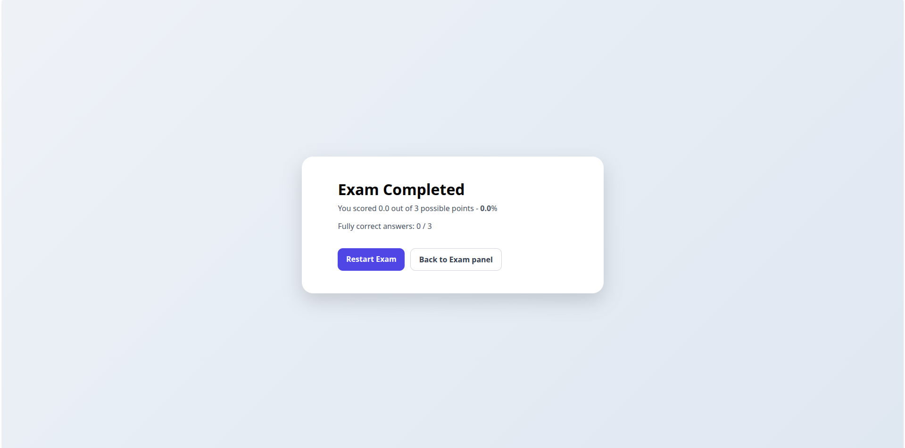

# ExamTopics Unilimted for Free

A local web application for studying ExamTopics questions for free, featuring learning mode, exam simulation, and Anki flashcard export.

## Description

This application allows you to run ExamTopics exam questions locally without limitations or paid subscriptions. It is designed to support effective learning, realistic exam simulation, and quick generation of Anki flashcards.

## Features

- **Learning Mode** – freely browse questions, view correct answers, community votes, and user comments.
- **Exam Mode** – select the number of questions, answer randomly drawn questions, and receive an automatic final score.
- **Anki Mode** – export exam questions as Anki flashcards for spaced repetition learning.

## Application Views

- **Learn Mode**



- **Exam Mode**




## Installation & Usage

### Requirements
- Python 3
- not busy 5000 port

### Build from Source

#### On Linux:
```bash
git clone https://github.com/stanislawg1/free-exam-topics.git && cd free-exam-topics
```
```bash
python3 -m venv .venv
```
```bash
source ./.venv/bin/activate
```
```bash
pip install -r requirements.txt
python3 run.py
```

## Visit [http://localhost:5000](http://localhost:5000) & enjoy :)
